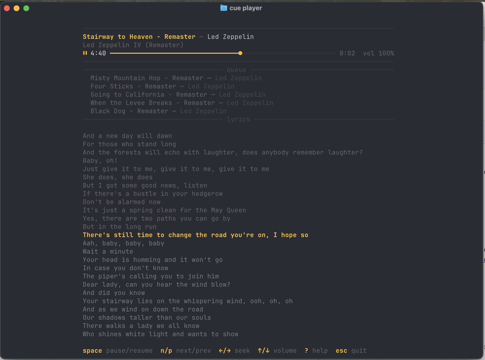

# cue

A command-line Spotify remote control. It talks to the Spotify Web API to control playback on whatever device is already running. It does not stream audio.



## Prerequisites

- A [Spotify Premium](https://www.spotify.com/premium/) account (Web API playback control requires Premium)
- A Spotify app with a Client ID and Client Secret (see [Spotify app setup](#spotify-app-setup))

## Features

- Live player view with synced lyrics, progress bar, and keyboard controls
- Fuzzy search with auto-pick for unambiguous matches
- Interactive arrow-key pickers for tracks, albums, and devices
- Relative volume control (`+10`, `-10`)
- Smart device selection — auto-picks based on hostname
- Graceful degradation when piped (no color, no interactivity, auto-picks best result)
- Shell completions for bash, zsh, and fish

## Install

```bash
curl -LsSf https://github.com/todor-ilivanov/cue/releases/latest/download/cue-installer.sh | sh
```

Prebuilt binaries are published to [GitHub Releases](https://github.com/todor-ilivanov/cue/releases) for Linux and macOS (x86_64 and arm64). The installer drops `cue` into `~/.cargo/bin` or `~/.local/bin`.

Before the first command, create a Spotify app and write your credentials to `config.toml` — see [Spotify app setup](#spotify-app-setup) and [Config file](#config-file). Shell completions can be installed with `cue completions <shell>` (see [Shell completions](#shell-completions)).

## Commands

No quotes needed around multi-word queries. Spotify must be open on at least one device.

```
cue play <query>          Play a track, album (--album), or playlist (--playlist)
cue pause                 Pause playback
cue resume                Resume playback
cue next / prev           Skip forward or back
cue now                   Show what's currently playing
cue player                Live player with lyrics, progress bar, keyboard controls (--slim to hide lyrics)
cue search <query>        Search for tracks, albums (--album), or artists (--artist)
cue devices               List available devices
cue device [name]         Show active device, or transfer to one by name
cue volume [level]        Show or set volume (0-100, +N, -N)
cue radio                 Start a radio based on the currently playing track
cue queue [query]         Show the queue, or add a track to it
cue completions <shell>   Generate shell completions (bash, zsh, fish)
```

Run `cue <command> --help` for full options.

## Examples

```bash
cue devices                       # see what's available
cue device MacBook                # pick a device
cue play bohemian rhapsody        # play a track
cue player                        # open the live player
cue volume +10                    # turn it up
cue queue another one bites the dust
cue search --album abbey road     # browse albums
```

## Configuration

### Build from source

```bash
cargo build --release
cp target/release/cue ~/.local/bin/
```

### Spotify app setup

1. Go to https://developer.spotify.com/dashboard
2. Create a new app
3. Set the redirect URI to `http://127.0.0.1:8888/callback`
4. Note your Client ID and Client Secret

### Config file

The config directory depends on your OS:

| OS    | Path                                      |
|-------|-------------------------------------------|
| Linux | `~/.config/cue/`                          |
| macOS | `~/Library/Application Support/cue/`      |

Create it and add your credentials to `config.toml`:

```toml
[spotify]
client_id = "your_client_id"
client_secret = "your_client_secret"
```

### Authentication

Run any command (e.g. `cue devices`). Your browser will open automatically for Spotify OAuth. After authorizing, the token is saved and refreshed automatically.

## Shell completions

```bash
cue completions bash >> ~/.bashrc
cue completions zsh > ~/.zfunc/_cue
cue completions fish > ~/.config/fish/completions/cue.fish
```

## License

[MIT](LICENSE)
